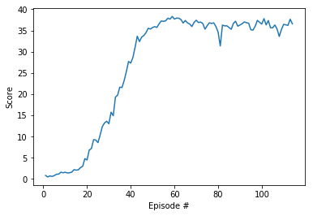

## Project Report

### Learning Algorithm

The algorithm chosen to solve this environment is Deep Deterministic Policy Gradient (DDPG). DDPG is a policy gradient algorithm that uses a stochastic behaviour policy for good exploration but estimates a deterministic target policy, which is much easier to learn. It is an algorithm which concurrently learns a Q-function and a policy. It uses off-policy data and the Bellman equation to learn the Q-function, and uses the Q-function to learn the policy. DDPG is an actor-critic algorithm as well; it primarily uses two neural networks, one for the actor and one for the critic. These networks compute action predictions for the current state and generate a temporal-difference (TD) error signal each time step.

### Model Architecture and Hyperparameters

I used two deep neural networks (actor-critic), each with two hidden layers of 256-128 nodes, with ReLU activation functions on the hidden layers and tanh on the output layers. I used shallower DNNs than the DDPG paper. This produced superior performance compared to Udacity's baseline implementation.

A `learning rate` of 1e-4 on each DNN and `BATCH_SIZE` of 128 were used along with replay `BUFFER_SIZE` of 1e5, `GAMMA` 0.99 and `TAU` of 1e-3. There was no change to the default Ornstein-Uhlenbeck noise parameters (0.15 `theta` and 0.2 `sigma`).

### Results

The model was able to achieve the 30 average reward goal in 114 episodes. The goal was to score +30 on average over 100 consecutive episodes. The agent trained faster when two hidden layers of 256-128 nodes and learning rate of 1e-4 where used on both actor and critic networks. 

### Future work

- **Hyperparameter tuning** - I focused on tuning hidden size and learning rate which gave major improvements. Other parameters would probably impact learning 
- Use the [PPO](https://arxiv.org/abs/1707.06347) and [A3C](https://arxiv.org/abs/1602.01783) algorithms and compare results with DDPG.
- Try implementing DDPG and PPO on other environment like `Gym` or Unity Crawler.

### References 

* [Continuous control with deep reinforcement learning.](https://arxiv.org/abs/1509.02971)
* https://spinningup.openai.com/en/latest/algorithms/ddpg.html
* https://pemami4911.github.io/blog/2016/08/21/ddpg-rl.html
* https://github.com/udacity/deep-reinforcement-learning/tree/master/ddpg-bipedal